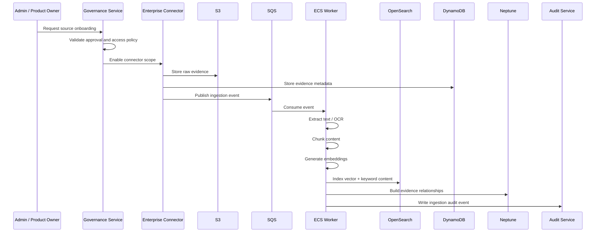
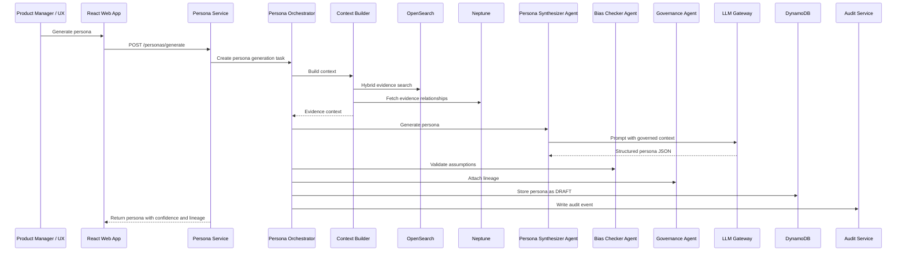
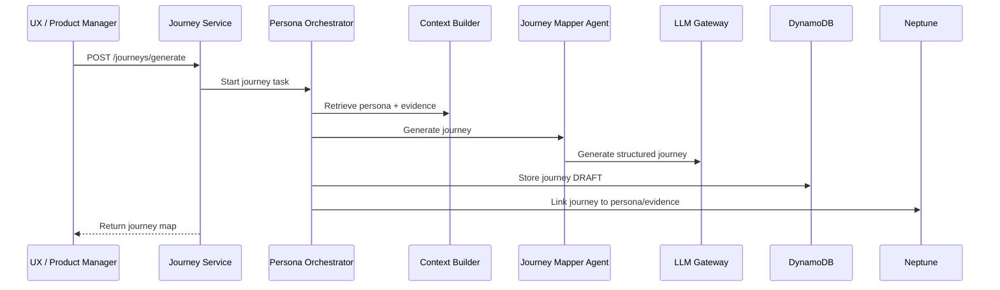
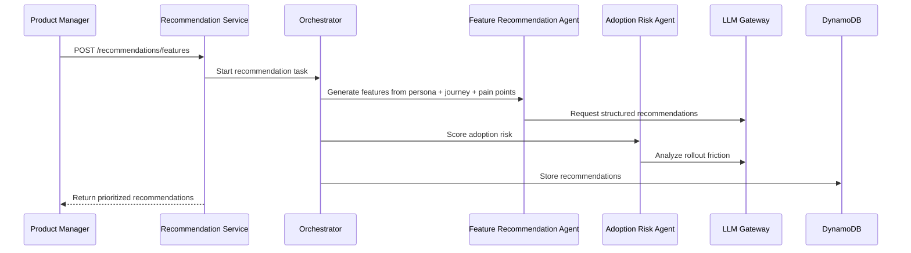
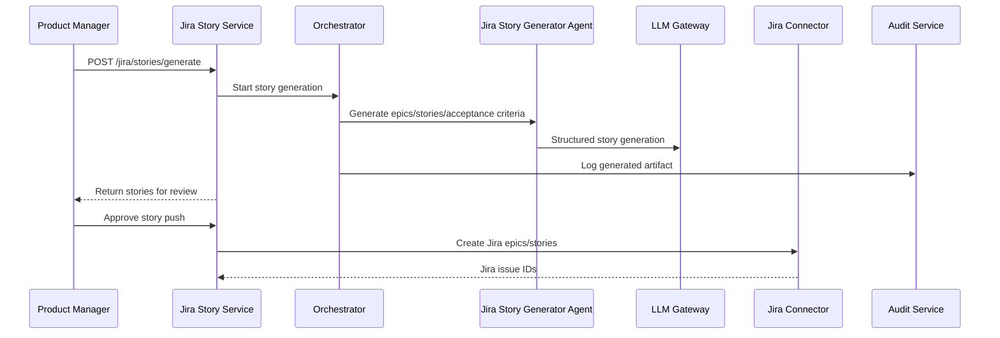

# PersonaGrid — End-State Low-Level Design (LLD) & Copilot/Codex-Ready Architecture

**Target firm context:** JPMorganChase-style enterprise environment  
**System name:** PersonaGrid / Persona Intelligence Grid  
**Document type:** End-State LLD + Implementation Architecture  
**Version:** 1.0  
**Date:** 2026-05-13  

---

## 1. Executive Summary

PersonaGrid is an enterprise-grade, governed AI platform that converts approved enterprise evidence into reusable product intelligence:

- Personas
- User journeys
- Jobs-To-Be-Done (JTBD)
- Pain points
- Feature recommendations
- Adoption-risk insights
- Jira-ready epics and stories
- Evidence lineage
- Governance approvals

The platform is designed for a large financial enterprise where security, auditability, explainability, access control, evidence lineage, cost control, and human approval are mandatory.

This is not a standalone chatbot. It is a reusable product-intelligence platform and SDK that can be embedded into greenfield and brownfield applications across the firm.

---

## 2. Business Problem

Large enterprise product teams often recreate persona research and journey mapping manually. Product decisions may be based on partial feedback, scattered Jira tickets, support issues, Confluence pages, operational reports, call transcripts, and product analytics.

Common issues:

1. Personas are recreated repeatedly across teams.
2. Product decisions are not consistently evidence-backed.
3. User journeys are manually created and become stale.
4. Jira stories often miss business context and acceptance criteria.
5. Adoption risk is discovered too late.
6. Risk and compliance teams lack clear evidence lineage.
7. AI-generated insights are difficult to govern without workflow, lineage, and audit trails.

PersonaGrid addresses this by creating a governed, evidence-backed, reusable product-intelligence layer.

---

## 3. Goals

### 3.1 Business Goals

1. Create reusable enterprise personas across product areas.
2. Convert enterprise evidence into product insights.
3. Reduce manual effort in persona research and journey mapping.
4. Improve feature prioritization using evidence-backed recommendations.
5. Generate consistent Jira-ready delivery artifacts.
6. Improve adoption planning before product rollout.
7. Provide explainability and auditability for AI-generated outputs.
8. Enable product teams to integrate persona intelligence through SDKs and APIs.

### 3.2 Technical Goals

1. Provide secure APIs and SDKs.
2. Support connector-based evidence ingestion.
3. Support hybrid search using vector and keyword retrieval.
4. Maintain lineage from AI output to source evidence.
5. Enforce RBAC, ABAC, and policy controls.
6. Support human-in-the-loop approvals.
7. Support model routing across approved LLM providers.
8. Provide observability, evaluation, cost tracking, and audit logging.
9. Support multi-tenant workspace isolation.
10. Scale across many product teams and business units.

---

## 4. Non-Goals

1. PersonaGrid will not autonomously execute business actions.
2. PersonaGrid will not directly modify production systems without approval.
3. PersonaGrid will not replace product managers, UX researchers, or risk reviewers.
4. PersonaGrid will not ingest unauthorized or unapproved data.
5. PersonaGrid will not expose raw sensitive evidence to unauthorized users.
6. PersonaGrid will not make final compliance decisions automatically.

---

## 5. Stakeholders

| Stakeholder | Responsibility |
|---|---|
| Product Managers | Define product area, review personas, approve feature recommendations |
| UX Designers / Researchers | Validate personas, journeys, pain points, and user needs |
| Business Analysts | Provide domain context and validate requirements |
| Engineering Teams | Integrate APIs/SDKs, consume Jira stories, build product features |
| Operations Users | Provide workflow feedback and validate operational journeys |
| Risk / Compliance Users | Review lineage, sensitive data handling, AI assumptions, approvals |
| Data Owners | Approve access to Jira, Confluence, ServiceNow, analytics, and documents |
| Platform Engineering | Own infrastructure, connectors, deployment, monitoring, and reliability |
| AI/ML Platform Team | Own LLM gateway, model routing, prompt templates, evaluation, guardrails |
| Cybersecurity | Review access control, secrets, encryption, threat model, logging |
| Architecture Review Board | Review enterprise architecture alignment |
| Executive Sponsors | Track adoption, business value, reuse, and governance maturity |
| Application Teams | Integrate PersonaGrid into greenfield/brownfield systems |
| Support / SRE Teams | Operate platform, incident response, SLAs, observability |

---

## 6. End-State Component Inventory

### 6.1 User Experience Components

1. React Web App
2. Persona Explorer
3. Journey Studio
4. Evidence Lineage Viewer
5. Recommendation Workspace
6. Adoption Risk Dashboard
7. Approval Console
8. Admin Console
9. Operational Dashboard

### 6.2 Integration Components

1. Python SDK
2. TypeScript SDK
3. REST APIs
4. SDK Gateway Service
5. Webhook/Event Integration
6. Internal Product App Integration Adapter

### 6.3 Core Product Services

1. Persona Service
2. Journey Service
3. JTBD Service
4. Recommendation Service
5. Adoption Risk Service
6. Evidence Intelligence Service
7. Governance Service
8. Jira Story Generation Service
9. Export Service
10. Workspace/Tenant Service

### 6.4 Orchestration Components

1. Persona Orchestrator
2. Task Router
3. Context Builder
4. Prompt Template Manager
5. Tool Registry
6. Response Validator
7. Confidence Scorer
8. Workflow State Manager

### 6.5 AI Agent Components

1. Evidence Collector Agent
2. Persona Synthesizer Agent
3. Journey Mapper Agent
4. JTBD Agent
5. Feature Recommendation Agent
6. Adoption Risk Agent
7. Bias & Assumption Checker Agent
8. Governance / Lineage Agent
9. Jira Story Generator Agent
10. Summarization Agent
11. Evidence Classification Agent

### 6.6 LLM Platform Components

1. LLM Gateway
2. Model Router
3. Prompt Guardrails
4. PII Redaction Service
5. Output Policy Checker
6. Prompt Version Store
7. LLM Cost Tracker
8. LLM Evaluation Store

### 6.7 Data & Retrieval Components

1. Vector Search Service
2. Keyword Search Service
3. Metadata Repository Service
4. Evidence Graph Service
5. Audit Logging Service
6. Redis Cache
7. Hybrid Retrieval Service

### 6.8 Storage Components

1. Amazon S3 — Raw evidence, documents, exports
2. DynamoDB — Metadata, persona registry, versions, approvals
3. OpenSearch — Vector index and keyword search
4. Neptune / Graph DB — Persona-evidence-journey graph
5. Athena — Usage and adoption analytics
6. CloudWatch Logs — Logs and audit events
7. Secrets Manager — Secrets and API keys
8. KMS — Encryption keys

### 6.9 Enterprise Connectors

1. Jira Connector
2. Confluence Connector
3. ServiceNow Connector
4. Survey / Feedback Connector
5. Product Analytics Connector
6. Call Transcript Connector
7. Application Logs Connector
8. Internal DB Proxy Connector
9. SharePoint / Document Repository Connector
10. Git / Engineering Docs Connector

### 6.10 Async Processing Components

1. SQS Queue
2. ECS Worker Service
3. OCR / Text Extraction Worker
4. Chunking Worker
5. Embedding Worker
6. Evidence Indexer
7. Graph Builder Worker
8. Notification Service
9. Retry / Dead Letter Queue Processor

### 6.11 Observability & Governance Components

1. AWS X-Ray / Distributed Tracing
2. CloudWatch Metrics
3. Operational Dashboard
4. Alerts
5. LLM Cost Tracker
6. LLM Evaluation Store
7. Evidence Lineage Viewer
8. Human Approval Workflow
9. Audit Trail Viewer

---

## 7. High-Level Architecture

```mermaid
flowchart TB

subgraph USER_LAYER["User Layer"]
    PM["Product Manager"]
    UX["UX Designer"]
    BA["Business Analyst"]
    ENG["Engineer"]
    OPS["Operations User"]
    RISK["Risk / Compliance User"]
    EXEC["Executive Sponsor"]
end

subgraph CHANNEL_LAYER["Channel Layer"]
    WEB["React Web App"]
    SDK_PY["Python SDK"]
    SDK_TS["TypeScript SDK"]
    APPS["Internal Product Apps"]
end

subgraph SECURITY_LAYER["API & Security Layer"]
    ALB["Application Load Balancer"]
    APIGW["Internal API Gateway"]
    AUTH["AuthN: IAM Role + API Key"]
    AUTHZ["AuthZ: RBAC / ABAC"]
    RATE["Rate Limiting / Quotas"]
    POLICY["Policy Enforcement"]
end

subgraph APP_LAYER["Application Services - FastAPI on ECS"]
    PERSONA_API["Persona Service"]
    JOURNEY_API["Journey Service"]
    JTBD_API["JTBD Service"]
    RECO_API["Recommendation Service"]
    ADOPTION_API["Adoption Risk Service"]
    EVIDENCE_API["Evidence Intelligence Service"]
    GOV_API["Governance Service"]
    JIRA_API["Jira Story Service"]
    EXPORT_API["Export Service"]
    SDK_GATEWAY["SDK Gateway"]
end

subgraph ORCH_LAYER["Orchestration Layer"]
    ORCH["Persona Orchestrator"]
    TASK_ROUTER["Task Router"]
    CONTEXT_BUILDER["Context Builder"]
    PROMPT_MGR["Prompt Template Manager"]
    RESPONSE_VALIDATOR["Response Validator"]
    CONFIDENCE["Confidence Scorer"]
end

subgraph AGENT_LAYER["Bounded AI Agent Layer"]
    EVIDENCE_AGENT["Evidence Collector Agent"]
    PERSONA_AGENT["Persona Synthesizer Agent"]
    JOURNEY_AGENT["Journey Mapper Agent"]
    JTBD_AGENT["JTBD Agent"]
    FEATURE_AGENT["Feature Recommendation Agent"]
    ADOPTION_AGENT["Adoption Risk Agent"]
    BIAS_AGENT["Bias & Assumption Checker"]
    GOV_AGENT["Governance / Lineage Agent"]
    JIRA_AGENT["Jira Story Generator Agent"]
end

subgraph LLM_LAYER["LLM Gateway & Guardrails"]
    LLM_GATEWAY["LLM Gateway"]
    MODEL_ROUTER["Model Router"]
    GUARDRAILS["Guardrails / PII Redaction / Policy Checks"]
    OPENAI["OpenAI / Azure OpenAI"]
    INTERNAL_LLM["Internal LLM Suite"]
end

subgraph RETRIEVAL_LAYER["Retrieval & Knowledge Layer"]
    VECTOR["Vector Search Service"]
    KEYWORD["Keyword Search Service"]
    META["Metadata Repository Service"]
    GRAPH["Evidence Graph Service"]
    CACHE["Redis / ElastiCache"]
    AUDIT["Audit Logging Service"]
end

subgraph STORAGE_LAYER["Storage Layer"]
    S3["S3 Raw Evidence / Exports"]
    DDB["DynamoDB Persona Registry / Metadata"]
    OPENSEARCH["OpenSearch Vector + Keyword"]
    NEPTUNE["Neptune Graph DB"]
    ATHENA["Athena Usage Analytics"]
    CWLOGS["CloudWatch Logs"]
end

subgraph CONNECTOR_LAYER["Enterprise Connectors"]
    JIRA["Jira"]
    CONF["Confluence"]
    SNOW["ServiceNow"]
    SURVEY["Survey / Feedback"]
    ANALYTICS["Product Analytics"]
    CALLS["Call Transcripts"]
    LOGS["Application Logs"]
    DB_PROXY["Internal DB Proxy"]
    SHAREPOINT["SharePoint / Docs"]
    GIT["Git / Engineering Docs"]
end

subgraph ASYNC_LAYER["Async Processing"]
    SQS["SQS"]
    DLQ["Dead Letter Queue"]
    WORKER["ECS Worker"]
    OCR["OCR / Text Extraction"]
    CHUNKER["Chunking Worker"]
    EMBED["Embedding Worker"]
    INDEXER["Evidence Indexer"]
    GRAPH_BUILDER["Graph Builder"]
    NOTIFY["Notification Service"]
end

subgraph OBS_LAYER["Observability & Governance"]
    XRAY["AWS X-Ray"]
    METRICS["CloudWatch Metrics"]
    DASH["Operational Dashboard"]
    ALERTS["Alerts"]
    COST["LLM Cost Tracker"]
    EVAL["LLM Evaluation Store"]
    LINEAGE["Lineage Viewer"]
    APPROVALS["Approval Workflow"]
end

PM --> WEB
UX --> WEB
BA --> WEB
OPS --> WEB
RISK --> WEB
EXEC --> WEB
ENG --> SDK_PY
ENG --> SDK_TS
APPS --> SDK_TS

WEB --> ALB
SDK_PY --> APIGW
SDK_TS --> APIGW
APPS --> APIGW

ALB --> AUTH
APIGW --> AUTH
AUTH --> AUTHZ
AUTHZ --> RATE
RATE --> POLICY

POLICY --> PERSONA_API
POLICY --> JOURNEY_API
POLICY --> JTBD_API
POLICY --> RECO_API
POLICY --> ADOPTION_API
POLICY --> EVIDENCE_API
POLICY --> GOV_API
POLICY --> JIRA_API
POLICY --> EXPORT_API
POLICY --> SDK_GATEWAY

SDK_GATEWAY --> PERSONA_API
SDK_GATEWAY --> JOURNEY_API
SDK_GATEWAY --> RECO_API
SDK_GATEWAY --> ADOPTION_API

PERSONA_API --> ORCH
JOURNEY_API --> ORCH
JTBD_API --> ORCH
RECO_API --> ORCH
ADOPTION_API --> ORCH
EVIDENCE_API --> ORCH
JIRA_API --> ORCH

ORCH --> TASK_ROUTER
TASK_ROUTER --> CONTEXT_BUILDER
TASK_ROUTER --> PROMPT_MGR
TASK_ROUTER --> RESPONSE_VALIDATOR
RESPONSE_VALIDATOR --> CONFIDENCE

TASK_ROUTER --> EVIDENCE_AGENT
TASK_ROUTER --> PERSONA_AGENT
TASK_ROUTER --> JOURNEY_AGENT
TASK_ROUTER --> JTBD_AGENT
TASK_ROUTER --> FEATURE_AGENT
TASK_ROUTER --> ADOPTION_AGENT
TASK_ROUTER --> BIAS_AGENT
TASK_ROUTER --> GOV_AGENT
TASK_ROUTER --> JIRA_AGENT

PERSONA_AGENT --> LLM_GATEWAY
JOURNEY_AGENT --> LLM_GATEWAY
JTBD_AGENT --> LLM_GATEWAY
FEATURE_AGENT --> LLM_GATEWAY
ADOPTION_AGENT --> LLM_GATEWAY
BIAS_AGENT --> LLM_GATEWAY
JIRA_AGENT --> LLM_GATEWAY

LLM_GATEWAY --> MODEL_ROUTER
MODEL_ROUTER --> GUARDRAILS
GUARDRAILS --> OPENAI
GUARDRAILS --> INTERNAL_LLM

CONTEXT_BUILDER --> VECTOR
CONTEXT_BUILDER --> KEYWORD
CONTEXT_BUILDER --> META
CONTEXT_BUILDER --> GRAPH
ORCH --> CACHE
RESPONSE_VALIDATOR --> AUDIT
GOV_API --> AUDIT

VECTOR --> OPENSEARCH
KEYWORD --> OPENSEARCH
META --> DDB
GRAPH --> NEPTUNE
EVIDENCE_API --> S3
ADOPTION_API --> ATHENA
AUDIT --> CWLOGS
CACHE --> DDB

EVIDENCE_AGENT --> JIRA
EVIDENCE_AGENT --> CONF
EVIDENCE_AGENT --> SNOW
EVIDENCE_AGENT --> SURVEY
EVIDENCE_AGENT --> ANALYTICS
EVIDENCE_AGENT --> CALLS
EVIDENCE_AGENT --> LOGS
EVIDENCE_AGENT --> DB_PROXY
EVIDENCE_AGENT --> SHAREPOINT
EVIDENCE_AGENT --> GIT

JIRA --> S3
CONF --> S3
SNOW --> S3
SURVEY --> S3
CALLS --> S3
SHAREPOINT --> S3
GIT --> S3
LOGS --> OPENSEARCH
ANALYTICS --> ATHENA
DB_PROXY --> ATHENA

EVIDENCE_API --> SQS
PERSONA_API --> SQS
JOURNEY_API --> SQS
SQS --> WORKER
SQS --> DLQ
WORKER --> OCR
WORKER --> CHUNKER
WORKER --> EMBED
WORKER --> INDEXER
WORKER --> GRAPH_BUILDER
WORKER --> NOTIFY

OCR --> S3
CHUNKER --> S3
EMBED --> OPENSEARCH
INDEXER --> OPENSEARCH
INDEXER --> DDB
GRAPH_BUILDER --> NEPTUNE

APP_LAYER --> XRAY
ORCH_LAYER --> XRAY
AGENT_LAYER --> METRICS
LLM_GATEWAY --> COST
RESPONSE_VALIDATOR --> EVAL
GOV_AGENT --> LINEAGE
GOV_API --> APPROVALS

METRICS --> DASH
COST --> DASH
EVAL --> DASH
LINEAGE --> DASH
DASH --> ALERTS
```



---

## 8. End-to-End Runtime Flows

### 8.1 Evidence Onboarding & Ingestion Flow



### 8.2 Persona Generation Flow



### 8.3 Journey Generation Flow



### 8.4 Feature Recommendation Flow



### 8.5 Jira Story Generation Flow



---

## 9. Functional Requirements

### 9.1 Persona Management

| ID | Requirement |
|---|---|
| FR-001 | System shall generate personas from approved evidence sources. |
| FR-002 | System shall allow users to search personas by product area, persona name, status, and tags. |
| FR-003 | System shall maintain persona version history. |
| FR-004 | System shall support persona lifecycle: Draft, Reviewed, Approved, Published, Deprecated. |
| FR-005 | System shall display evidence lineage for every persona. |
| FR-006 | System shall support persona comparison. |
| FR-007 | System shall allow authorized users to approve or reject personas. |

### 9.2 Journey Management

| ID | Requirement |
|---|---|
| FR-101 | System shall generate current-state journeys from personas and evidence. |
| FR-102 | System shall generate future-state journeys from target outcomes. |
| FR-103 | System shall identify pain points at each journey step. |
| FR-104 | System shall link journey steps to evidence. |
| FR-105 | System shall export journeys to PDF, Markdown, Confluence, or Jira. |

### 9.3 Evidence Intelligence

| ID | Requirement |
|---|---|
| FR-201 | System shall ingest evidence from approved enterprise connectors. |
| FR-202 | System shall support manual upload for authorized users. |
| FR-203 | System shall extract text from PDFs, Word documents, HTML, text files, and transcripts. |
| FR-204 | System shall chunk, embed, and index evidence. |
| FR-205 | System shall classify evidence sensitivity. |
| FR-206 | System shall deduplicate evidence. |
| FR-207 | System shall maintain evidence freshness and source timestamps. |
| FR-208 | System shall support evidence search by semantic and keyword queries. |

### 9.4 Recommendation Management

| ID | Requirement |
|---|---|
| FR-301 | System shall generate feature recommendations from persona, journey, and pain points. |
| FR-302 | System shall assign impact score, effort score, confidence score, and adoption risk. |
| FR-303 | System shall explain why a recommendation was generated. |
| FR-304 | System shall link recommendations to supporting evidence. |

### 9.5 Adoption Risk

| ID | Requirement |
|---|---|
| FR-401 | System shall calculate adoption risk for proposed features. |
| FR-402 | System shall identify rollout friction. |
| FR-403 | System shall generate mitigation plans. |
| FR-404 | System shall use historical adoption signals where available. |

### 9.6 Jira Story Generation

| ID | Requirement |
|---|---|
| FR-501 | System shall generate epics, stories, and acceptance criteria. |
| FR-502 | System shall allow human review before pushing to Jira. |
| FR-503 | System shall create Jira tickets only after approval. |
| FR-504 | System shall store Jira issue IDs and link them to recommendations. |

### 9.7 Governance

| ID | Requirement |
|---|---|
| FR-601 | System shall enforce RBAC and ABAC. |
| FR-602 | System shall maintain audit logs for all critical actions. |
| FR-603 | System shall support approval workflows. |
| FR-604 | System shall show evidence lineage for AI outputs. |
| FR-605 | System shall detect unsupported AI claims. |
| FR-606 | System shall flag sensitive data risks. |

### 9.8 SDK and API Integration

| ID | Requirement |
|---|---|
| FR-701 | System shall expose REST APIs for all core capabilities. |
| FR-702 | System shall provide Python SDK. |
| FR-703 | System shall provide TypeScript SDK. |
| FR-704 | System shall support greenfield application integration. |
| FR-705 | System shall support brownfield application integration. |
| FR-706 | System shall support webhook/event callbacks for async jobs. |

---

## 10. Non-Functional Requirements

| ID | Category | Requirement |
|---|---|---|
| NFR-001 | Availability | Core APIs shall target 99.9% availability. |
| NFR-002 | Scalability | Platform shall scale horizontally on ECS Fargate. |
| NFR-003 | Performance | Synchronous read APIs should respond within 500ms p95 where no LLM call is involved. |
| NFR-004 | Performance | LLM-backed generation APIs should support async processing for long-running tasks. |
| NFR-005 | Security | All data at rest shall be encrypted using KMS-managed keys. |
| NFR-006 | Security | All data in transit shall use TLS. |
| NFR-007 | Security | Secrets shall be stored in AWS Secrets Manager. |
| NFR-008 | Access Control | System shall enforce RBAC and ABAC at API and data layers. |
| NFR-009 | Auditability | All persona, journey, recommendation, approval, and Jira-push actions shall be audited. |
| NFR-010 | Observability | System shall emit metrics, logs, traces, and business events. |
| NFR-011 | Reliability | Async processing shall support retries and DLQs. |
| NFR-012 | Compliance | AI outputs shall include lineage and confidence metadata. |
| NFR-013 | Cost Control | LLM usage shall be tracked by workspace, product area, model, and user. |
| NFR-014 | Maintainability | Services shall follow clean architecture and domain-driven module boundaries. |
| NFR-015 | Extensibility | New connectors and agents shall be pluggable. |
| NFR-016 | Data Isolation | Workspace-level data isolation shall be enforced. |
| NFR-017 | Resilience | System shall degrade gracefully when connectors or LLMs are unavailable. |
| NFR-018 | Evaluation | AI outputs shall be evaluated for schema validity, groundedness, and policy compliance. |

---

## 11. API Design

### 11.1 Persona APIs

```http
POST /api/v1/personas/generate
GET /api/v1/personas/{persona_id}
GET /api/v1/personas
PUT /api/v1/personas/{persona_id}
GET /api/v1/personas/{persona_id}/versions
POST /api/v1/personas/{persona_id}/approve
POST /api/v1/personas/{persona_id}/reject
POST /api/v1/personas/compare
```

### 11.2 Journey APIs

```http
POST /api/v1/journeys/generate
GET /api/v1/journeys/{journey_id}
GET /api/v1/journeys
PUT /api/v1/journeys/{journey_id}
POST /api/v1/journeys/{journey_id}/approve
POST /api/v1/journeys/{journey_id}/export
```

### 11.3 Evidence APIs

```http
POST /api/v1/evidence/upload
POST /api/v1/evidence/ingest
GET /api/v1/evidence/{evidence_id}
GET /api/v1/evidence/search
POST /api/v1/evidence/{evidence_id}/link
GET /api/v1/evidence/{evidence_id}/lineage
```

### 11.4 Recommendation APIs

```http
POST /api/v1/recommendations/features
GET /api/v1/recommendations/{recommendation_id}
POST /api/v1/recommendations/prioritize
POST /api/v1/recommendations/{recommendation_id}/approve
```

### 11.5 Adoption Risk APIs

```http
POST /api/v1/adoption-risk/score
GET /api/v1/adoption-risk/{feature_id}
POST /api/v1/adoption-risk/mitigation-plan
```

### 11.6 Jira Story APIs

```http
POST /api/v1/jira/stories/generate
POST /api/v1/jira/stories/push
GET /api/v1/jira/stories/{story_batch_id}
```

### 11.7 Governance APIs

```http
POST /api/v1/governance/approve
POST /api/v1/governance/reject
GET /api/v1/governance/audit/{entity_id}
GET /api/v1/governance/lineage/{entity_id}
GET /api/v1/governance/policies
```

### 11.8 Async Job APIs

```http
GET /api/v1/jobs/{job_id}
GET /api/v1/jobs/{job_id}/events
POST /api/v1/jobs/{job_id}/cancel
```

---

## 12. Request / Response Contracts

### 12.1 Generate Persona Request

```json
{
  "workspace_id": "fraud-ops",
  "product_area": "Fraud Operations",
  "target_user_group": "Fraud Investigator",
  "evidence_scope": {
    "source_types": ["JIRA", "CONFLUENCE", "SURVEY", "SERVICENOW"],
    "date_range": {
      "from": "2025-01-01",
      "to": "2026-05-13"
    },
    "tags": ["case-review", "fraud-alerts"]
  },
  "generation_options": {
    "include_confidence_score": true,
    "include_lineage": true,
    "require_human_review": true
  }
}
```

### 12.2 Generate Persona Response

```json
{
  "job_id": "job_123",
  "status": "COMPLETED",
  "persona": {
    "persona_id": "persona_fraud_investigator_v1",
    "name": "Fraud Investigator",
    "description": "Investigates suspicious transaction alerts and determines appropriate case actions.",
    "goals": [
      "Reduce false positives",
      "Make compliant decisions quickly",
      "Minimize manual system switching"
    ],
    "tasks": [
      "Review alerts",
      "Check customer profile",
      "Analyze transaction history",
      "Document case decision"
    ],
    "pain_points": [
      "Incomplete case context",
      "Multiple system hops",
      "Manual documentation burden"
    ],
    "systems_used": [
      "Case Management",
      "Transaction Search",
      "Customer Profile"
    ],
    "confidence_score": 0.84,
    "status": "DRAFT",
    "evidence_summary": {
      "evidence_count": 38,
      "sources": ["JIRA", "CONFLUENCE", "SURVEY", "SERVICENOW"]
    }
  }
}
```

---

## 13. Data Model

### 13.1 DynamoDB Tables

#### Table: PersonaRegistry

Partition/sort key design:

```text
PK = WORKSPACE#{workspace_id}#PERSONA#{persona_id}
SK = VERSION#{version}
```

Example:

```json
{
  "pk": "WORKSPACE#fraud-ops#PERSONA#fraud_investigator",
  "sk": "VERSION#v1",
  "persona_id": "fraud_investigator",
  "workspace_id": "fraud-ops",
  "name": "Fraud Investigator",
  "description": "Investigates suspicious transaction alerts.",
  "goals": ["Reduce false positives"],
  "pain_points": ["Multiple system switching"],
  "systems_used": ["Case Management", "Transaction Search"],
  "confidence_score": 0.84,
  "status": "DRAFT",
  "created_by": "user_id",
  "created_at": "2026-05-13T10:00:00Z",
  "updated_at": "2026-05-13T10:00:00Z"
}
```

#### Table: EvidenceMetadata

```text
PK = WORKSPACE#{workspace_id}#EVIDENCE#{evidence_id}
SK = METADATA
```

```json
{
  "pk": "WORKSPACE#fraud-ops#EVIDENCE#jira_12345",
  "sk": "METADATA",
  "evidence_id": "jira_12345",
  "source_type": "JIRA",
  "source_system": "Jira",
  "source_url": "internal-jira-url",
  "title": "Fraud case review delay",
  "product_area": "Fraud Operations",
  "sensitivity": "INTERNAL",
  "ingestion_status": "INDEXED",
  "created_at": "2026-05-13T10:00:00Z"
}
```

#### Table: JourneyRegistry

```text
PK = WORKSPACE#{workspace_id}#JOURNEY#{journey_id}
SK = VERSION#{version}
```

#### Table: RecommendationRegistry

```text
PK = WORKSPACE#{workspace_id}#RECOMMENDATION#{recommendation_id}
SK = METADATA
```

#### Table: ApprovalWorkflow

```text
PK = WORKSPACE#{workspace_id}#ENTITY#{entity_id}
SK = APPROVAL#{approval_id}
```

#### Table: AuditEvents

```text
PK = WORKSPACE#{workspace_id}#ENTITY#{entity_id}
SK = EVENT#{timestamp}#{event_id}
```

---

## 14. OpenSearch Index Design

### 14.1 evidence-index

```json
{
  "settings": {
    "index": {
      "knn": true
    }
  },
  "mappings": {
    "properties": {
      "workspace_id": { "type": "keyword" },
      "evidence_id": { "type": "keyword" },
      "source_type": { "type": "keyword" },
      "product_area": { "type": "keyword" },
      "title": { "type": "text" },
      "content": { "type": "text" },
      "chunk_id": { "type": "keyword" },
      "embedding": {
        "type": "knn_vector",
        "dimension": 1536
      },
      "sensitivity": { "type": "keyword" },
      "created_at": { "type": "date" }
    }
  }
}
```

### 14.2 persona-index

Used for searching personas by semantic and keyword attributes.

### 14.3 recommendation-index

Used for searching feature recommendations and historical product decisions.

---

## 15. Graph Model

### 15.1 Nodes

1. Persona
2. Journey
3. JourneyStep
4. PainPoint
5. FeatureRecommendation
6. Evidence
7. SourceSystem
8. ProductArea
9. Risk
10. JiraStory
11. Approval

### 15.2 Edges

```text
Persona -[HAS_JOURNEY]-> Journey
Journey -[HAS_STEP]-> JourneyStep
JourneyStep -[HAS_PAIN_POINT]-> PainPoint
PainPoint -[SUPPORTED_BY]-> Evidence
FeatureRecommendation -[SOLVES]-> PainPoint
FeatureRecommendation -[IMPACTS]-> Persona
Evidence -[FROM_SOURCE]-> SourceSystem
Persona -[BELONGS_TO]-> ProductArea
JiraStory -[IMPLEMENTS]-> FeatureRecommendation
Approval -[APPROVES]-> Persona
Approval -[APPROVES]-> Journey
```

---

## 16. Agent Design

### 16.1 Agent Contract

All agents follow a standard contract:

```python
class AgentInput(BaseModel):
    workspace_id: str
    task_id: str
    user_id: str
    context: dict
    evidence_refs: list[str]
    policy_context: dict

class AgentOutput(BaseModel):
    task_id: str
    status: str
    result: dict
    confidence_score: float
    evidence_refs: list[str]
    warnings: list[str]
    requires_human_review: bool
```

### 16.2 Agent Responsibilities

| Agent | Responsibility |
|---|---|
| Evidence Collector Agent | Retrieves approved evidence from connectors and retrieval services |
| Persona Synthesizer Agent | Creates structured personas from evidence |
| Journey Mapper Agent | Creates journey maps and journey steps |
| JTBD Agent | Creates Jobs-To-Be-Done statements |
| Feature Recommendation Agent | Recommends features and prioritizes opportunities |
| Adoption Risk Agent | Scores rollout and adoption risk |
| Bias Checker Agent | Detects unsupported assumptions and overgeneralization |
| Governance Agent | Attaches lineage, approval state, and audit metadata |
| Jira Story Generator Agent | Generates Jira-ready epics, stories, and acceptance criteria |

---

## 17. LLM Gateway Design

### 17.1 Responsibilities

1. Centralize all LLM calls.
2. Enforce prompt policies.
3. Redact PII where required.
4. Route requests to approved models.
5. Track cost, latency, tokens, and failures.
6. Store prompt and response metadata.
7. Apply output schema validation.
8. Support fallback models.

### 17.2 Model Routing Policy

| Use Case | Preferred Model Type |
|---|---|
| Summarization | Lower-cost approved model |
| Persona generation | Reasoning-capable approved model |
| Journey generation | Reasoning-capable approved model |
| Jira story generation | Structured-output capable model |
| Sensitive data tasks | Internal approved LLM |
| Low-risk draft tasks | Approved external enterprise LLM |

---

## 18. Security Architecture

### 18.1 Authentication

1. Internal users authenticate through enterprise SSO.
2. Service-to-service calls use IAM roles.
3. SDK/API clients use API keys or signed internal tokens.
4. API keys are scoped to workspace and capability.

### 18.2 Authorization

1. RBAC controls user role permissions.
2. ABAC controls data access by product area, workspace, source, sensitivity, and region.
3. Policy enforcement occurs at API layer and retrieval layer.
4. Sensitive evidence is filtered before context is sent to LLM.

### 18.3 Encryption

1. TLS for all network communication.
2. KMS encryption for S3, DynamoDB, OpenSearch, Neptune, and logs.
3. Secrets stored in Secrets Manager.
4. API keys hashed and rotated.

### 18.4 Audit

Audit events are required for:

1. Evidence ingestion
2. Persona generation
3. Journey generation
4. Recommendation generation
5. Approval/rejection
6. Jira push
7. Admin configuration changes
8. Connector access changes
9. LLM requests and responses metadata

---

## 19. Integration Model

### 19.1 Greenfield Application Integration

Greenfield teams can directly integrate PersonaGrid using SDKs or APIs.

#### Example: Python SDK

```python
from personagrid import PersonaGridClient

client = PersonaGridClient(
    api_key="...",
    workspace_id="fraud-ops"
)

persona = client.personas.generate(
    product_area="Fraud Operations",
    target_user_group="Fraud Investigator",
    evidence_sources=["JIRA", "CONFLUENCE", "SURVEY"]
)

journey = client.journeys.generate(
    persona_id=persona.persona_id,
    journey_type="CURRENT_STATE"
)

recommendations = client.recommendations.features(
    persona_id=persona.persona_id,
    journey_id=journey.journey_id
)
```

#### Example: TypeScript SDK

```typescript
import { PersonaGridClient } from "@internal/personagrid-sdk";

const client = new PersonaGridClient({
  apiKey: process.env.PERSONAGRID_API_KEY!,
  workspaceId: "fraud-ops"
});

const persona = await client.personas.generate({
  productArea: "Fraud Operations",
  targetUserGroup: "Fraud Investigator",
  evidenceSources: ["JIRA", "CONFLUENCE", "SURVEY"]
});
```

### 19.2 Brownfield Application Integration

Brownfield systems can integrate in four ways:

1. Embedded UI widgets
2. REST API calls
3. SDK-based backend integration
4. Event-driven integration

#### Brownfield Pattern A: Embedded Persona Panel

Existing internal product app embeds a PersonaGrid panel to show persona context.

```text
Existing App UI -> PersonaGrid UI Widget -> PersonaGrid APIs
```

#### Brownfield Pattern B: Backend API Integration

Existing backend calls PersonaGrid APIs to enrich its workflows.

```text
Existing Backend -> SDK Gateway -> Persona Service / Journey Service
```

#### Brownfield Pattern C: Event-Driven Integration

Existing systems publish events when new evidence or feedback is available.

```text
Existing System -> EventBridge/SQS -> Evidence Ingestion Worker
```

#### Brownfield Pattern D: Jira Integration

Existing delivery workflow uses PersonaGrid-generated stories after approval.

```text
PersonaGrid -> Human Approval -> Jira Connector -> Jira Project
```

---

## 20. Technology Stack

### 20.1 Frontend

1. React
2. TypeScript
3. Vite
4. Tailwind CSS
5. React Flow
6. TanStack Query
7. Internal design system

### 20.2 Backend

1. Python 3.11+
2. FastAPI
3. Pydantic
4. Uvicorn/Gunicorn
5. Boto3
6. OpenSearch Python client
7. Redis client
8. Internal auth libraries
9. OpenAI/Azure OpenAI SDK or approved internal LLM SDK

### 20.3 AI / Retrieval

1. LLM Gateway
2. Approved enterprise LLMs
3. Embedding model
4. OpenSearch k-NN
5. Hybrid retrieval
6. Prompt template versioning
7. Groundedness evaluation

### 20.4 AWS Infrastructure

1. ECS Fargate
2. Application Load Balancer
3. API Gateway / Internal Gateway
4. SQS
5. S3
6. DynamoDB
7. OpenSearch
8. Neptune
9. Athena
10. Glue Data Catalog
11. Redis / ElastiCache
12. CloudWatch
13. X-Ray
14. Secrets Manager
15. KMS
16. IAM
17. VPC, private subnets, security groups

### 20.5 DevOps

1. GitHub Enterprise / Bitbucket
2. CI/CD pipeline
3. Terraform
4. Docker
5. Helm if Kubernetes is used
6. Static code scanning
7. Dependency scanning
8. Container image scanning
9. IaC policy checks

---

## 21. Infrastructure Design

### 21.1 Network

1. Deploy services in private subnets.
2. ALB/API Gateway exposes only approved internal endpoints.
3. Use VPC endpoints for AWS services where possible.
4. Restrict egress through approved network controls.
5. Use security groups per service boundary.

### 21.2 Compute

1. ECS Fargate for API services.
2. ECS Fargate workers for async processing.
3. Autoscaling based on CPU, memory, queue depth, and latency.
4. Separate worker pools for ingestion, embedding, indexing, and graph building.

### 21.3 Storage

1. S3 for raw evidence and exports.
2. DynamoDB for operational metadata.
3. OpenSearch for hybrid search.
4. Neptune for graph lineage.
5. Athena for analytics.
6. CloudWatch Logs for logs and audit streams.

### 21.4 Deployment Environments

1. DEV
2. QA
3. UAT
4. PROD

Each environment must have separate:

1. AWS accounts or isolated resource groups
2. KMS keys
3. Secrets
4. Data stores
5. CI/CD deployment stages

---

## 22. Repository Structure — Copilot/Codex Ready

```text
personagrid/
├── README.md
├── docs/
│   ├── architecture/
│   │   ├── end_state_lld.md
│   │   ├── api_contracts.md
│   │   ├── data_model.md
│   │   ├── security_model.md
│   │   └── integration_patterns.md
│   └── runbooks/
│       ├── incident_response.md
│       ├── connector_failure.md
│       └── llm_gateway_failure.md
├── backend/
│   ├── app/
│   │   ├── main.py
│   │   ├── api/
│   │   │   ├── persona_routes.py
│   │   │   ├── journey_routes.py
│   │   │   ├── jtbd_routes.py
│   │   │   ├── recommendation_routes.py
│   │   │   ├── adoption_routes.py
│   │   │   ├── evidence_routes.py
│   │   │   ├── governance_routes.py
│   │   │   ├── jira_routes.py
│   │   │   └── job_routes.py
│   │   ├── services/
│   │   │   ├── persona_service.py
│   │   │   ├── journey_service.py
│   │   │   ├── jtbd_service.py
│   │   │   ├── recommendation_service.py
│   │   │   ├── adoption_service.py
│   │   │   ├── evidence_service.py
│   │   │   ├── governance_service.py
│   │   │   ├── jira_service.py
│   │   │   ├── vector_search_service.py
│   │   │   ├── metadata_service.py
│   │   │   ├── graph_service.py
│   │   │   └── audit_service.py
│   │   ├── orchestration/
│   │   │   ├── orchestrator.py
│   │   │   ├── task_router.py
│   │   │   ├── context_builder.py
│   │   │   ├── prompt_manager.py
│   │   │   ├── response_validator.py
│   │   │   └── confidence_scorer.py
│   │   ├── agents/
│   │   │   ├── base_agent.py
│   │   │   ├── evidence_collector_agent.py
│   │   │   ├── persona_synthesizer_agent.py
│   │   │   ├── journey_mapper_agent.py
│   │   │   ├── jtbd_agent.py
│   │   │   ├── feature_recommendation_agent.py
│   │   │   ├── adoption_risk_agent.py
│   │   │   ├── bias_checker_agent.py
│   │   │   ├── governance_lineage_agent.py
│   │   │   └── jira_story_agent.py
│   │   ├── llm/
│   │   │   ├── llm_gateway.py
│   │   │   ├── model_router.py
│   │   │   ├── guardrails.py
│   │   │   ├── pii_redaction.py
│   │   │   └── prompt_templates/
│   │   ├── connectors/
│   │   │   ├── base_connector.py
│   │   │   ├── jira_connector.py
│   │   │   ├── confluence_connector.py
│   │   │   ├── servicenow_connector.py
│   │   │   ├── survey_connector.py
│   │   │   ├── analytics_connector.py
│   │   │   ├── call_transcript_connector.py
│   │   │   ├── app_logs_connector.py
│   │   │   ├── internal_db_proxy_connector.py
│   │   │   └── sharepoint_connector.py
│   │   ├── workers/
│   │   │   ├── ingestion_worker.py
│   │   │   ├── ocr_worker.py
│   │   │   ├── chunking_worker.py
│   │   │   ├── embedding_worker.py
│   │   │   ├── indexing_worker.py
│   │   │   ├── graph_builder_worker.py
│   │   │   └── notification_worker.py
│   │   ├── models/
│   │   │   ├── persona.py
│   │   │   ├── journey.py
│   │   │   ├── evidence.py
│   │   │   ├── recommendation.py
│   │   │   ├── adoption_risk.py
│   │   │   ├── governance.py
│   │   │   └── job.py
│   │   ├── repositories/
│   │   │   ├── dynamodb_repository.py
│   │   │   ├── opensearch_repository.py
│   │   │   ├── s3_repository.py
│   │   │   ├── neptune_repository.py
│   │   │   └── audit_repository.py
│   │   ├── core/
│   │   │   ├── config.py
│   │   │   ├── security.py
│   │   │   ├── logging.py
│   │   │   ├── exceptions.py
│   │   │   └── telemetry.py
│   │   └── tests/
│   ├── Dockerfile
│   └── pyproject.toml
├── frontend/
│   ├── src/
│   │   ├── pages/
│   │   ├── components/
│   │   ├── api/
│   │   ├── hooks/
│   │   ├── routes/
│   │   └── types/
│   └── package.json
├── sdk/
│   ├── python/
│   │   └── personagrid/
│   └── typescript/
│       └── src/
├── infra/
│   ├── terraform/
│   │   ├── environments/
│   │   ├── modules/
│   │   └── main.tf
│   └── pipelines/
└── docker-compose.yml
```

---

## 23. Implementation Backlog

### Epic 1 — Platform Foundation

1. Create FastAPI service shell.
2. Add auth middleware.
3. Add RBAC/ABAC policy middleware.
4. Add logging and tracing.
5. Add standard error model.
6. Add health endpoints.
7. Add Dockerfile and CI pipeline.

### Epic 2 — Evidence Intelligence

1. Implement Evidence Service.
2. Implement S3 repository.
3. Implement EvidenceMetadata DynamoDB repository.
4. Implement ingestion event publishing.
5. Implement text extraction worker.
6. Implement chunking worker.
7. Implement embedding worker.
8. Implement OpenSearch indexing.
9. Implement evidence search API.

### Epic 3 — Persona Generation

1. Implement Persona Service.
2. Implement Context Builder.
3. Implement Persona Synthesizer Agent.
4. Implement LLM Gateway.
5. Implement Response Validator.
6. Implement Confidence Scorer.
7. Store persona versions in DynamoDB.
8. Display evidence lineage.

### Epic 4 — Journey and JTBD

1. Implement Journey Service.
2. Implement Journey Mapper Agent.
3. Implement JTBD Agent.
4. Link journey to persona and evidence.
5. Store journey versions.
6. Export journey.

### Epic 5 — Recommendations and Adoption Risk

1. Implement Recommendation Service.
2. Implement Feature Recommendation Agent.
3. Implement Adoption Risk Agent.
4. Store recommendations.
5. Score impact, effort, confidence, and risk.
6. Generate mitigation plan.

### Epic 6 — Jira Story Generation

1. Implement Jira Story Service.
2. Implement Jira Story Agent.
3. Generate epics/stories/acceptance criteria.
4. Add approval before Jira push.
5. Implement Jira Connector.
6. Store Jira issue links.

### Epic 7 — Governance

1. Implement Governance Service.
2. Implement approval workflow.
3. Implement audit service.
4. Implement lineage viewer.
5. Implement bias checker.
6. Implement policy checks.

### Epic 8 — SDKs

1. Implement Python SDK.
2. Implement TypeScript SDK.
3. Add API client generation.
4. Add examples.
5. Add integration tests.

### Epic 9 — Observability and Evaluation

1. Add CloudWatch metrics.
2. Add X-Ray tracing.
3. Add LLM cost tracker.
4. Add LLM evaluation store.
5. Add dashboard.
6. Add alerts.

---

## 24. Risks and Mitigations

| Risk | Impact | Mitigation |
|---|---|---|
| Unauthorized data ingestion | High | Connector approvals, RBAC/ABAC, data owner sign-off |
| Sensitive data sent to LLM | High | PII redaction, policy filters, internal LLM routing |
| Hallucinated personas | High | Evidence grounding, confidence score, bias checker, human approval |
| Poor adoption by product teams | Medium | SDKs, embedded widgets, simple UX, reusable templates |
| High LLM cost | Medium | Model router, caching, token budgets, cost dashboard |
| Connector failures | Medium | Retry, DLQ, connector health monitoring |
| Stale evidence | Medium | Freshness timestamps, scheduled sync, stale evidence warnings |
| Inconsistent output quality | Medium | Prompt versioning, schema validation, evaluation store |
| Overly complex architecture | Medium | Modular services, phased delivery, platform standards |
| Audit gaps | High | Central audit service and immutable audit events |
| Slow generation latency | Medium | Async job model, streaming status, caching |
| Data duplication | Low | Deduplication by source ID, content hash, metadata matching |

---

## 25. Operating Model

### 25.1 Ownership

| Area | Owner |
|---|---|
| Product roadmap | Product Owner / Platform Product Manager |
| Platform APIs | Backend Engineering |
| React UI | Frontend Engineering |
| SDKs | Developer Experience Team |
| Connectors | Platform Integration Team |
| LLM Gateway | AI Platform Team |
| Guardrails | AI Platform + Risk |
| Infrastructure | Platform Engineering / SRE |
| Governance | Risk / Compliance + Product Governance |
| Data access approvals | Data Owners |
| Support | SRE / Application Support |

### 25.2 Support Model

1. L1: Application support
2. L2: Platform engineering
3. L3: AI platform / connector owners / data owners
4. Risk escalation: Governance and compliance team

---

## 26. Definition of Done

A feature is complete only when:

1. API contract is documented.
2. Unit tests are added.
3. Integration tests are added.
4. Security checks are passed.
5. Audit logging is implemented.
6. Metrics and tracing are implemented.
7. Error handling is standardized.
8. Access control is validated.
9. Documentation is updated.
10. Deployment pipeline is updated.
11. Runbook is updated if operationally relevant.

---

## 27. Key Design Principles

1. Evidence-first AI
2. Human approval before publishing
3. Explainability by default
4. Secure by design
5. API-first and SDK-first
6. Connector-driven ingestion
7. Model-agnostic LLM gateway
8. Modular bounded agents
9. Enterprise observability
10. Reusable product intelligence across the firm

---

## 28. Summary

PersonaGrid is an end-state enterprise platform for governed product intelligence. It enables teams to convert approved enterprise evidence into personas, journeys, recommendations, adoption-risk insights, and Jira-ready artifacts.

The system is designed for large-scale enterprise adoption with:

1. Secure APIs
2. SDKs
3. Evidence connectors
4. AI agents
5. LLM gateway
6. Governance workflows
7. Lineage and auditability
8. Observability and cost controls
9. Greenfield and brownfield integration patterns
10. Cloud-native AWS infrastructure
---

## 29. Value Realization Recommendation

My recommendation: add **Value Realization Service** and **Executive Value Dashboard** as first-class components in the architecture.

Without these components, management may see PersonaGrid primarily as a technical AI platform. With them, PersonaGrid becomes an enterprise efficiency and governance platform that clearly demonstrates measurable business value.

### 29.1 Value Realization Service

The Value Realization Service should capture and calculate business-efficiency metrics across the product lifecycle.

Key responsibilities:

1. Capture baseline manual effort for persona creation, journey mapping, evidence preparation, recommendation drafting, and Jira story creation.
2. Track actual system-generated time and human review time.
3. Calculate estimated hours saved per product initiative.
4. Track reuse of approved personas, journeys, recommendations, and Jira templates.
5. Track governance approval cycle time.
6. Track evidence-pack preparation time saved.
7. Track LLM cost per generated artifact and per product initiative.
8. Publish value metrics to analytics and executive dashboards.

### 29.2 Executive Value Dashboard

The Executive Value Dashboard should show business outcomes in management-friendly metrics.

Recommended dashboard KPIs:

1. Discovery-to-requirement cycle-time reduction.
2. Jira story readiness improvement.
3. Evidence-pack preparation effort saved.
4. Engineering clarification cycles reduced.
5. Duplicate discovery effort avoided.
6. Approved personas and journeys reused.
7. Governance approval cycle-time reduction.
8. Productivity hours released per quarter.
9. LLM cost per initiative.
10. Adoption-risk items identified before delivery.

### 29.3 Architecture Placement

Add these components to the end-state architecture:

```text
Persona Service
Journey Service
Recommendation Service
Jira Story Service
Governance Service
        ↓
Value Realization Service
        ↓
DynamoDB / Athena
        ↓
Executive Value Dashboard
```

### 29.4 Business Positioning

PersonaGrid should be positioned as:

```text
A governed product-intelligence platform that improves delivery efficiency, evidence traceability, product decision quality, and reuse across the enterprise.
```

This makes the platform easier to justify to senior leadership because value is measured continuously, not only explained qualitatively.

